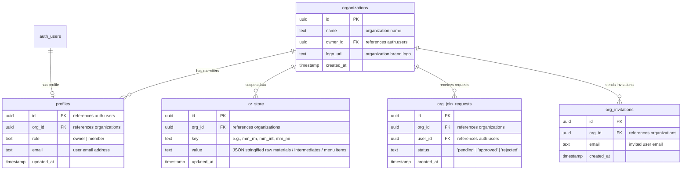

# Database Schema Documentation: MiseMap

This document details the database schema and security policies required for the multi-tenant architecture of the MiseMap application on Supabase.

---

## 1. Schema Diagram Overview



---

## 2. Table Specifications

### `organizations`
Stores tenant organizations.
*   `id` (`uuid`, Primary Key): Generated via `gen_random_uuid()`.
*   `name` (`text`, NOT NULL): The organization name.
*   `owner_id` (`uuid`, Foreign Key): References `auth.users(id)` (on delete set null).
*   `logo_url` (`text`, Optional): URL path to the organization profile logo.
*   `created_at` (`timestamptz`): Defaults to `now()`.

### `profiles`
Stores user profile information mapping individuals to organizations and roles.
*   `id` (`uuid`, Primary Key): References `auth.users(id)` (on delete cascade).
*   `org_id` (`uuid`, Foreign Key): References `organizations(id)` (on delete set null).
*   `role` (`text`): User role inside the tenant, defaults to `'member'` (`'owner'` or `'member'`).
*   `email` (`text`, Optional): Email address of the user.
*   `updated_at` (`timestamptz`): Defaults to `now()`.

### `org_join_requests`
Maintains user requests to join specific organizations.
*   `id` (`uuid`, Primary Key): Generated via `gen_random_uuid()`.
*   `org_id` (`uuid`, Foreign Key): References `organizations(id)` (on delete cascade).
*   `user_id` (`uuid`, Foreign Key): References `auth.users(id)` (on delete cascade).
*   `status` (`text`): Default `'pending'`.
*   `created_at` (`timestamptz`): Defaults to `now()`.
*   *Constraint*: Unique combination of `user_id` and `org_id` to prevent duplicate requests.

### `org_invitations`
Tracks invites sent by organization owners to potential members.
*   `id` (`uuid`, Primary Key): Generated via `gen_random_uuid()`.
*   `org_id` (`uuid`, Foreign Key): References `organizations(id)` (on delete cascade).
*   `email` (`text`, NOT NULL): Target email invited.
*   `created_at` (`timestamptz`): Defaults to `now()`.
*   *Constraint*: Unique combination of `org_id` and `email`.

### `kv_store`
Stores client application data blobs scoped per organization.
*   `id` (`uuid`, Primary Key): Generated via `gen_random_uuid()`.
*   `org_id` (`uuid`, Foreign Key): References `organizations(id)` (on delete cascade).
*   `key` (`text`, NOT NULL): Data keys (e.g. `mm_rm`, `mm_int`, `mm_mi`).
*   `value` (`text`, NOT NULL): JSON serialized array string.
*   `updated_at` (`timestamptz`): Defaults to `now()`.
*   *Constraint*: Unique combination of `org_id` and `key`.

---

## 3. Metadata Inspection Queries

Run these SQL scripts in the **Supabase Dashboard → SQL Editor** to fetch metadata details and verify schema status.

### Query A: Verify Table Existence and Row Counts
```sql
select 
    schemaname, 
    tablename, 
    tableowner, 
    hasindexes
from 
    pg_tables 
where 
    schemaname = 'public';
```

### Query B: Fetch Columns and Data Types
```sql
select 
    table_name, 
    column_name, 
    data_type, 
    is_nullable, 
    column_default
from 
    information_schema.columns 
where 
    table_schema = 'public'
order by 
    table_name, 
    ordinal_position;
```

### Query C: List RLS Policies Enabled on Tables
```sql
select 
    schemaname, 
    tablename, 
    policyname, 
    permissive, 
    roles, 
    cmd, 
    qual, 
    with_check
from 
    pg_policies 
where 
    schemaname = 'public';
```

### Query D: Inspect Foreign Keys & Constraints
```sql
select 
    tc.table_name, 
    kcu.column_name, 
    ccu.table_name as foreign_table_name, 
    ccu.column_name as foreign_column_name 
from 
    information_schema.table_constraints as tc 
    join information_schema.key_column_usage as kcu
      on tc.constraint_name = kcu.constraint_name
      and tc.table_schema = kcu.table_schema
    join information_schema.constraint_column_usage as ccu
      on ccu.constraint_name = tc.constraint_name
      and ccu.table_schema = ccu.table_schema
where 
    tc.constraint_type = 'FOREIGN KEY' 
    and tc.table_schema = 'public';
```
