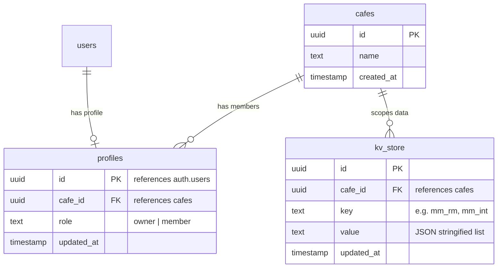

# Implementation Plan: Authentication & Cafe Multi-Tenancy (Step 4)

This document outlines the detailed architecture, database schema, and frontend modifications required to implement user authentication and multi-tenancy (multi-cafe isolation) in MiseMap.

---

## 1. Database Schema Design (Supabase)

We will introduce a tenant-based architecture where all data keys in the key-value store (`kv_store`) are scoped to a specific `cafe_id`. 



### SQL Migrations (Execute in SQL Editor)

```sql
-- 1. Create Cafes Table
create table if not exists cafes (
  id uuid primary key default gen_random_uuid(),
  name text not null,
  created_at timestamptz default now()
);

-- 2. Create User Profiles Table (Linked to Supabase Auth)
create table if not exists profiles (
  id uuid primary key references auth.users(id) on delete cascade,
  cafe_id uuid references cafes(id) on delete set null,
  role text default 'member',
  updated_at timestamptz default now()
);

-- Enable RLS on Profiles and Cafes
alter table cafes enable row level security;
alter table profiles enable row level security;

-- 3. Upgrade kv_store Table for Multi-Tenancy
alter table kv_store add column if not exists cafe_id uuid references cafes(id) on delete cascade;
alter table kv_store drop constraint if exists kv_store_pkey cascade;
alter table kv_store add constraint kv_store_cafe_key_unique unique (cafe_id, key);

-- Enable RLS on kv_store
alter table kv_store enable row level security;
```

### Row Level Security (RLS) Policies
These security rules ensure that users can only read or modify data belonging to their assigned cafe:

```sql
-- kv_store RLS Policies
create policy "Users can read their cafe's data" on kv_store
  for select using (
    cafe_id = (select cafe_id from profiles where id = auth.uid())
  );

create policy "Users can insert/update their cafe's data" on kv_store
  for all using (
    cafe_id = (select cafe_id from profiles where id = auth.uid())
  );
```

---

## 2. Frontend Architecture Modifications

### A. Auth & Cafe Onboarding Screens
We will create a beautiful, modern auth portal (`src/components/AuthPortal.jsx`):
- **Glassmorphic Login/Signup Box**: Clean layout with background gradients matching the MiseMap design system.
- **Cafe Creation Flow**: If a user is not associated with any cafe after signup, present two choices:
  1. **Create a Cafe**: Type a cafe name to spawn a new tenant.
  2. **Join a Cafe**: Input a shared Cafe ID to join an existing team.

### B. React Authentication Context (`src/context/AuthContext.jsx`)
A global context to manage session, profile, and current cafe:
```javascript
export const AuthProvider = ({ children }) => {
  const [user, setUser] = useState(null)
  const [profile, setProfile] = useState(null)
  const [loading, setLoading] = useState(true)

  // Listen to Supabase auth state changes
  // Fetch user profile and associated cafe details
}
```

### C. Scoped Key-Value Storage Updates (`src/lib/storage.js`)
We will rewrite `storage.get` and `storage.set` to inject the active `cafe_id` on every query:

```javascript
export const storage = {
  async get(key, cafeId) {
    const { data, error } = await supabase
      .from('kv_store')
      .select('value')
      .eq('key', key)
      .eq('cafe_id', cafeId)
      .maybeSingle()
    if (error) throw error
    return data ? data.value : null
  },

  async set(key, value, cafeId) {
    const { error } = await supabase
      .from('kv_store')
      .upsert({ 
        key, 
        value, 
        cafe_id: cafeId,
        updated_at: new Date().toISOString() 
      }, { onConflict: 'cafe_id,key' })
    if (error) throw error
  }
}
```

### D. Upgraded Hooks (`src/hooks/useShared.js`)
We will pass the active `cafeId` down from the Auth Context to `useShared` to ensure all remote loads/saves are correctly scoped:
```javascript
export const useShared = (key, def, cafeId) => {
  // Scopes local storage key: `${key}:${cafeId}`
  // Pulls & pushes from Supabase using storage.get(key, cafeId)
}
```

---

## 3. Verification Plan

### Manual Test Cases
1. **User Sign Up & Cafe Creation**: Register a new account `owner@cafe1.com`, name it "Cafe 1", and add raw materials.
2. **Isolation Test**: Register a second account `owner@cafe2.com`, name it "Cafe 2". Verify that Cafe 2's dashboard is completely empty and does not see Cafe 1's items.
3. **Collaboration Test**: Invite `barista@cafe1.com` to Cafe 1 by adding them. Verify they instantly see all materials of Cafe 1.
